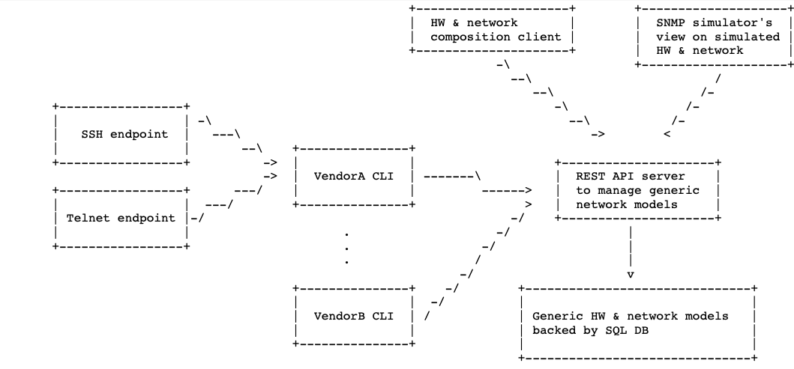

Architecture
------------

The overall system architecture is depicted on the following
high-level diagram:

Essentially, `NESi` is a terminal based command line simulator that comes with a
REST API server and the corresponding client. The server maintains
the models of the simulated devices in the underlying database, while the client provides a
command-line interface, simulating the behaviour of a vendor-specific device.

For future implementations of `NESi` its planned to extract the REST API Server architecture to
be able to boot a simulated device without the necessity of the API being up and running.

REST API server & models
++++++++++++++++++++++++

The `nesi-restapi` tool is a standalone python-based REST server instance that will run locally.

The role of the REST API server is to maintain and expose a collection of models
representing the properties of a simulated network devices.

Both hardware and software components of a simulated device are composed via setup processes,
run during the startup of the REST API server. Software components can also be created by the user
while the API is running. Hardware components should only be created by the setup processes.

A more detailed explanation on the startup process can be found in `development.rst`

The three main properties that indicate which cli implementation will be used by a switch are:

* Vendor ID: specifies that this `NESi` model simulates a network device
  manufactured by this vendor (e.g. Alcatel)
* Model ID: specifies that this `NESi` model simulates a network device
  of this specific model (e.g. 7360)
* Version ID: specifies that this `NESi` model simulates a network device
  of certain hardware revision (e.g. FX-4)

With the following property a switch can be directly addressed:

* UUID: an identifier that is unique to one specific instance of the simulated
  device. It can either be set manually in the setup script of each individual switch or
  it will be automatically set if left empty.

The models that represent the underlying database consist of every property found across all
switches.
The differentiation of each model come with the vendor-specific implementation of the corresponding schemas.
Each individual resource is addressed by its API endpoint that is specified in the corresponding view file.

REST API client / CLI
++++++++++++++++++++++++++++++

The `nesi-cli` tool serves two purposes:

* Access and modify the properties of the models in the underlying database, accessed via the
  REST API server.
* Simulate the command line interface of the network devices operating system.

The CLI simulation functionality is implemented by rendering Jinja2 templates
in the context of the switch. Each "screen" is in general maintained in
a dedicated template file.

A more detailed explanation on the template handling can be found in `development.rst`

Command and input processing is implemented in the Python code. Both
template and CLI command implementations are highly specific to the kind
of simulated device. For that reason, templates & CLI code are normally kept
in a dedicated Vendor folders that are automatically discovered by the
`NESi` client tool.

The backend implementation is matched via the switches vendor ID,
model ID and version ID properties.

In addition to the first three (vendor, model and version), the forth
identifier - UUID is required to address any specific network device instance.

The REST API client expects the UUID of the switch to pull the first three remaining identifiers
from its database model and select the respective CLI implementation. The client then
will be using the switch's data for CLI screen rendering and storing
operator-requested changes to the simulated switch.

CLI servers
+++++++++++

Network devices typically offer CLI access via serial line, telnet and ssh. To
fully simulate network devices, the REST API client can be started in a daemon mode to simulate
telnet and ssh behaviour.

While the telnet implementation is already working a ssh daemon is a feature that is planned for
a future release of the project.

